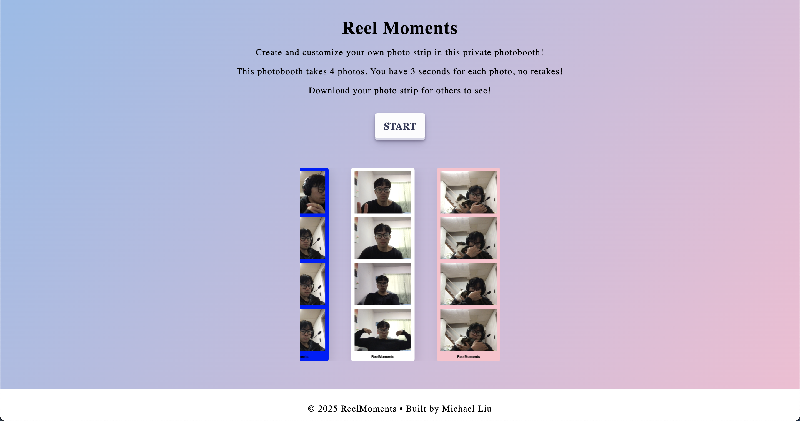

# Reel Moments


## Overview
Ever wanted a photobooth you can use right from your laptop or phone? Reel Moments is a simple web app that lets you snap four photos with a countdown, try out fun filters, and save your strip — just like a real photobooth. No fancy setup, no downloads — just point, click, and capture the moment.

 ## Features
- Timer with flash to indicate picture taken
- Change colour of the photo strip
- Change the filter of the photos (WIP)

## Tech Stack
- **Frontend**: HTML, CSS, JavaScript

## Installation
1. Clone the repository
   ```sh
   git clone https://github.com/michaelliuuu/ReelMoments.git
   cd photo_strip
   ```
2. Open index.html with Live Server

## License
This project is licensed under the MIT License.
